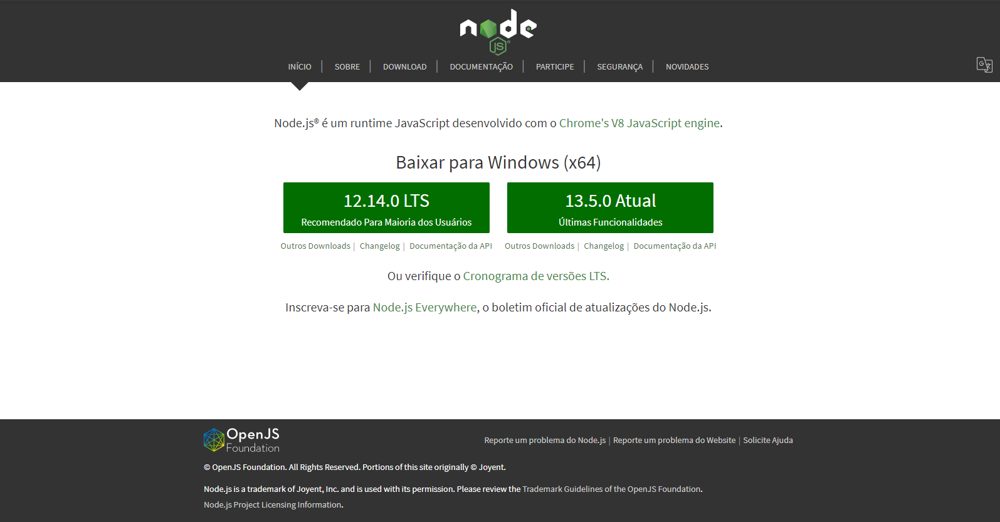
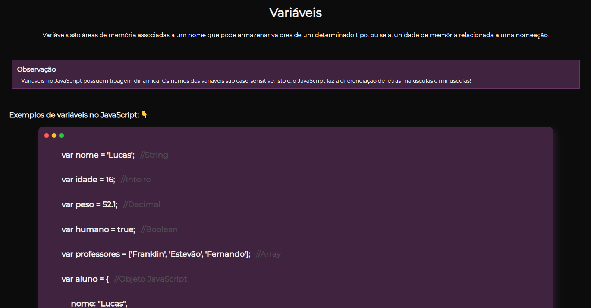
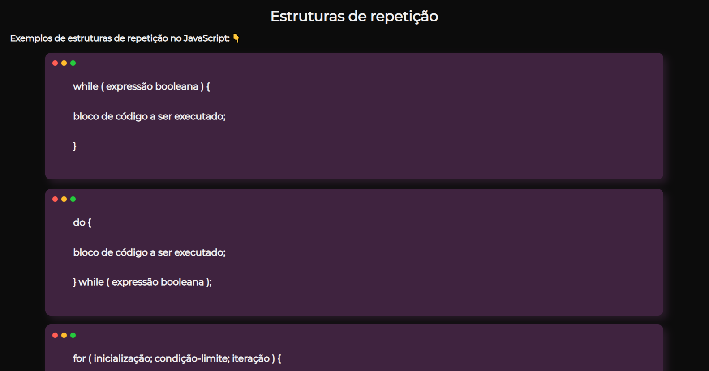

<h1 align="center">Seus primeiros passos com JavaScript!</h1>

    
    
<b>Aprenda uma das linguagens mais populares do Github e que possui uma curva de aprendizado impressionante!</b>

  

## Sobre o repositório 🗂

Repositório criado com o objetivo de ajudar outros a entenderem melhor a linguagem JavaScript! Assim, você poderá ver a aplicação e explicação de cada recurso que é utilizada em cada arquivo (como variáveis, funções e etc). Caso você não conheça o JavaScript e esteja iniciando no "maravilhoso universo da programação", haverá a seguir uma breve explicação do que é o JavaScript e como você pode começar a codificar!

## Sobre o JavaScript 

JavaScript é uma linguagem de programação de auto nível, leve, interpretada e é mais conhecida como a linguagem de script para páginas Web, mas usada também em vários outros ambientes sem browser e isso se deu com o surgimento do node.js! avaScript é uma linguagem fácil de se aprender e é muito poderosa, pois podemos fazer simples páginas web e até aplicativos nativos multiplataformas!

<b> Não se deve confundir o JavaScript com a linguagem de programação Java! </b>

 

## Como executar códigos JavaScript 💻

Você pode executar códigos JavaScript atráves do browser sem grandes dificuldades, mas caso queira aprofundar seus conhecimentos em algum framework, é necessário você fazer a instalação do node.js e juntamente com ele o NPM!

    

Site para o download do node.js e NPM: [nodejs.org](https://nodejs.org/pt-br/)

  

## Fotos do projeto 📸

    

    

 

## Autor

🙎‍♂ **Lucas Alvarenga**

* Meu Portifólio: https://alvarengadev.firebaseapp.com
* Github: [@Alvarenga-Dev](https://github.com/Alvarenga-Dev)

## Dá uma estrelinha e compartilha! ⭐️🚀

Copyright © 2019 [Lucas Alvarenga](https://github.com/Alvarenga-Dev).  
