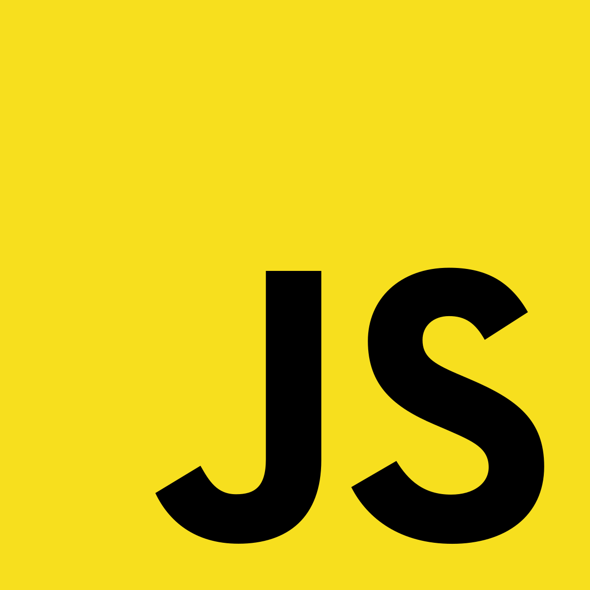

<h1 align="center">Seus primeiros passos com JavaScript!</h1>
<p align="center">
    
    <p align="center"><b>Aprenda uma das linguagens mais populares do Github e que possui uma curva de aprendizado impressionante!</b></p>
</p>

<br/><br/>

## Sobre o repositório 🗂

<p>Repositório criado com o objetivo de ajudar outros a entenderem melhor a linguagem JavaScript! Assim, você poderá ver a aplicação e explicação de cada recurso que é utilizada em cada arquivo (como variáveis, funções e etc). Caso você não conheça o JavaScript e esteja iniciando no "maravilhoso universo da programação", haverá a seguir uma breve explicação do que é o JavaScript e como você pode começar a codificar!</p>

## Sobre o JavaScript 

<p>JavaScript é uma linguagem de programação de auto nível, leve, interpretada e é mais conhecida como a linguagem de script para páginas Web, mas usada também em vários outros ambientes sem browser e isso se deu com o surgimento do node.js! O JavaScript é uma linguagem fácil de se aprender e é muito poderosa, pois podemos fazer simples páginas web e até aplicativos nativos multiplataformas!</p>

<p><b> Não se deve confundir o JavaScript com a linguagem de programação Java! </b></p>

<br/>

## Como executar códigos JavaScript 💻

<p>Você pode executar códigos JavaScript atráves do browser sem grandes dificuldades, mas caso queira aprofundar seus conhecimentos em algum framework, é necessário você fazer a instalação do node.js e juntamente com ele o NPM!</p>

<p align="center">
    
</p>

Site para o download do node.js e NPM: [nodejs.org](https://nodejs.org/pt-br/)

<br/><br/>

## Fotos sobre o diretório de introdução 📸

<p align="center">
    
</p>

<p align="center">
    
</p>

<p align="center">Esses são os primeiros passos que você pode dar na programação usando JavaScript!</p>

<br/>

## Como usar os diretórios _ES6 e _webpack 📝

<p>Verifique primeiro qual gerenciador de pacotes você está utilizando (Npm ou Yarn). Após isso instale as seguintes dependências.</p>

```bash
yarn add @babel/cli
yarn add @babel/preset-env
yarn add @babel/core
yarn add webpack
yarn add webpack-cli
yarn add babel-loader
```

> Você pode utilizar o npm, acima é apenas o exemplo de instalação utilizando o yarn e mostrando quais dependências realizei a instalação!


## Autor

🙎‍♂ **Lucas Alvarenga**

* Meu Portifólio: https://alvarengadev.firebaseapp.com
* Github: [@Alvarenga-Dev](https://github.com/Alvarenga-Dev)

## Dá uma estrelinha e compartilha! ⭐️🚀

Copyright © 2019 [Lucas Alvarenga](https://github.com/Alvarenga-Dev). <br/>
